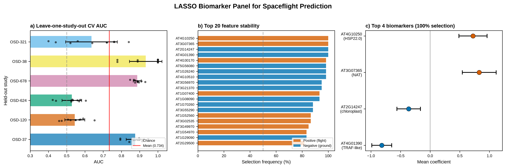
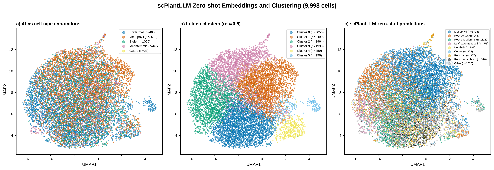
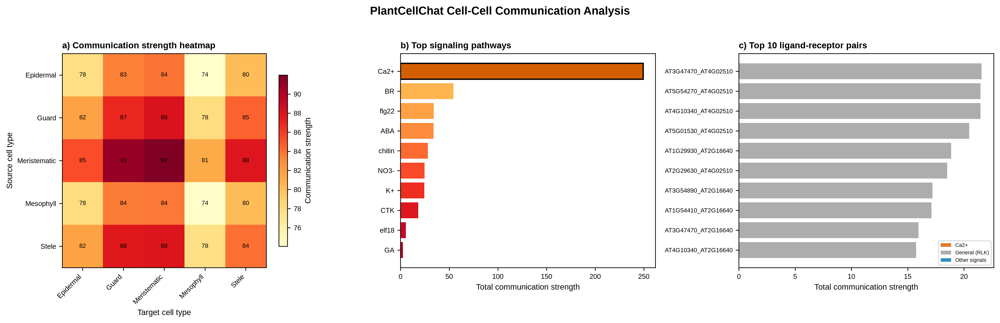

# Arabidopsis Spaceflight Omics

**LASSO biomarker discovery, single-cell atlas integration, and Ca²⁺-dominated cell–cell communication in the *Arabidopsis thaliana* spaceflight response.**

A multi-track computational meta-analysis of NASA OSDR transcriptomics, a published seed-to-seed single-cell atlas, and plant foundation models. Manuscript prepared for *npj Microgravity*.

> Richard Barker — GeneLab Plant Analysis Working Group, NASA Open Science Data Repository

---

## What this study asks

Individual spaceflight plant experiments are small and confounded by tissue, accession, and flight platform. This project asks whether a **stable, cross-study transcriptomic signature of spaceflight** can be learned from pooled NASA OSDR data — and whether its biology can be resolved at single-cell and cell–cell-communication resolution.

## Three tracks

### Track 1 — LASSO biomarker panel
An elastic-net (α = 0.5) model with **leave-one-study-out cross-validation** across 6 OSDR studies (156 pooled samples, 32,548 genes) yields an **85-gene panel** predictive of spaceflight vs. ground (mean CV AUC = **0.734**). Four genes are selected at 100% frequency.

### Track 2 — scPlantLLM single-cell atlas integration
The **scPlantLLM** plant foundation model is run zero-shot on 9,998 cells of the Lee et al. (2025) seedling atlas. Poor cross-tissue transfer (loose accuracy ≈28%, ARI 0.033) is reported as an **honest negative result** on foundation-model domain shift.

### Track 3 — Cell–cell communication & spatial mapping
PlantCellChat inference identifies **Ca²⁺ signaling as dominant** (strength 249.5, 4.6× the next pathway). A **CBL9–CIPK23–AKT1** Ca²⁺/K⁺ crosstalk circuit is resolved, with guard cells as the primary signaling hub, and mapped onto plant anatomy with ggPlantmap.

---

## Key results

| Metric | Value |
|--------|-------|
| LASSO mean cross-study AUC | 0.734 |
| Stable biomarker genes (≥50% selection) | 85 |
| Top genes (100% selection) | AT4G10250, AT3G07365, AT2G14247, AT4G01390 |
| Atlas cells analysed | 9,998 (of 41,314) |
| scPlantLLM zero-shot accuracy (loose) | ≈28% |
| Dominant CCC pathway | Ca²⁺ (strength 249.5, 4.6× next) |
| Ca²⁺/K⁺ circuit | CBL9 → CIPK23 → AKT1 |

## Repository contents

- `track1_lasso_osdr/`, `track2_scplantllm_atlas/`, `track3_ccc_ggplantmap/` — analysis scripts, data, and figures per track
- `integration/` — cross-track integration analysis
- `manuscript/` — manuscript, 8 main figures (PNG + editable SVG), supplementary figures/tables, and `Supplementary_Methods.md`
- `requirements.txt` / `environment.R` — Python and R dependencies

## Data & code availability

- **NASA OSDR** — [biodata API](https://visualization.osdr.nasa.gov/biodata/api/) · studies OSD-37, -678, -38, -321, -120, -624
- **Seedling atlas** — GEO **GSE226097** (Lee et al., *Nature Plants* 2025)
- **Methods** — scPlantLLM (Cao et al., 2025), PlantCellChat, ggPlantmap (Jo & Kajala, 2024)
- **License** — MIT · see `LICENSE`
- **Archived release** — Zenodo DOI *(minted on first GitHub release; add badge here)*

---

*Results are discovery-only; no external validation cohort. See the manuscript's limitations section.*
